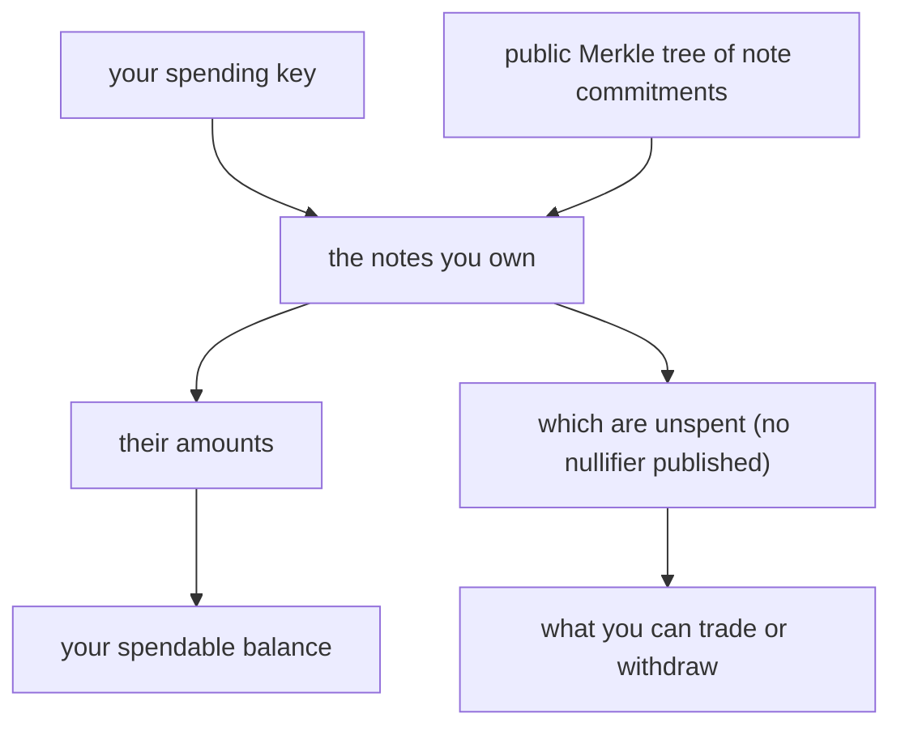
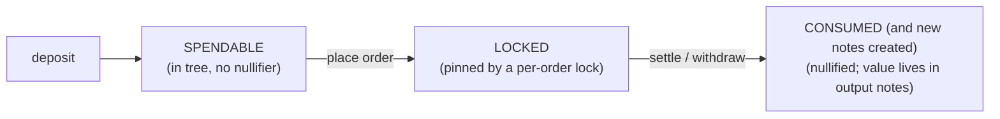

# Account Model

:::info[TL;DR]
Nyx has no server-held balance ledger. Your assets are **UTXO-style notes**
committed on-chain as hashes. Only you — with your spending key — can determine
which notes are yours and what they are worth. You reconstruct your account state
**client-side** from the public Merkle tree plus your keys; the engine never sees
the spending key that would let it do it for you.
:::

## Why there is no `GET /account` balance

On a custodial venue the operator keeps your balance in a database and serves it
on request. That only works because the operator can see what you hold — which is
exactly the position privacy Nyx is built to remove.

On Nyx your balance is the set of **notes** you own. A note is committed on-chain
as a Poseidon hash that seals its owner, value, and token. Determining that a
given note is *yours* and reading its amount requires your **spending key** — and
that key never enters the enclave. So the engine *cannot* compute your balance
for you, by construction. A balance endpoint would either be empty or would
require handing the enclave the one secret the whole design keeps out of it.

Instead, you reconstruct account state yourself:

This is the trustless design: the data you need is public, and only your keys
turn it into a balance.

## What you read, and from where

| You want | Read | Page |
|---|---|---|
| The current state of the on-chain tree | `GET /tree/root` | [Merkle Proofs](./merkle-proofs) |
| An inclusion proof for one of your notes | `GET /tree/inclusion` | [Merkle Proofs](./merkle-proofs) |
| A page of raw leaves (to rebuild a local mirror) | `GET /tree/leaves` | [Merkle Proofs](./merkle-proofs) |
| Your open orders | `GET /orders/{order_id}` (per order), the orders stream | [Get Order](../orders/get-order), [Orders Channel](../websocket/orders-channel) |
| Your continuation fills | the fills stream / your durable history | [Fills Channel](../websocket/fills-channel) |
| Venue-wide solvency | `GET /transparency` | [Transparency](./transparency) |

The **SDK** wraps this: from your seed it derives your keys, scans the tree, and
maintains a local note store of your spendable notes — so in practice you call an
SDK method, not the raw tree endpoints. See
[SDK → TypeScript Client](../sdk/typescript-client).

## The note lifecycle

A note moves through a small set of states, each enforced on-chain by a distinct
record so a note can never be used twice:

- **Spendable** — the note has an inclusion path in the current Merkle root and
  no nullifier has been published for it. You can back an order with it or
  withdraw it.
- **Locked** — an order references it as collateral; a per-order lock pins it
  between match and settlement so it cannot be double-committed.
- **Consumed** — settlement (or a withdrawal) has published its nullifier; the
  note is spent. Its value now lives in freshly created output notes — a change
  note for the unfilled remainder, the traded asset, and so on — each a new
  spendable note you own.

Because every touched note produces an on-chain record that blocks a second
touch, double-spends are impossible regardless of what the engine does.

## Trading keys vs. spending keys

Two different keys, two different jobs — keep them distinct.

| Key | Used for | Seen by the enclave? |
|---|---|---|
| **Trading key** | Signing orders (place / cancel / modify). The cryptographic identity an order is attributed to. | The public key, yes — to verify your signature. |
| **Spending key** | Deriving note ownership and nullifiers; authorizing withdrawals. | **Never.** It stays on your client. |

The enclave can verify *who placed an order* (trading key) without ever being
able to determine *what you hold* (spending key). That split is what lets
matching be authenticated while balances stay private.
