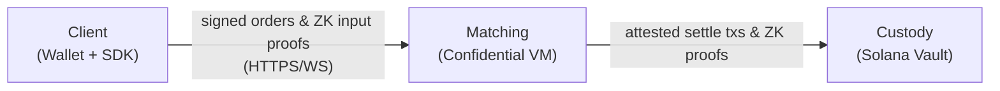

# Overview

:::info[TL;DR]
Nyx is a **privacy-preserving spot darkpool on Solana**. You submit hidden
orders to a matching engine that runs **inside an attested Intel TDX Confidential
VM** (a "CVM"). Settlement lands **trustlessly on Solana**, with a zero-knowledge
proof binding every transfer to a committed note. Solana sees custody and
proofs — never your order. The enclave sees your order — but can never move your
funds without an on-chain proof.
:::

## What Nyx is

Nyx is a dark pool: an order book where resting orders are not public. Side,
size, and limit price never appear in a Solana transaction, a log, or an
account. They live only inside a hardware-isolated enclave whose exact compiled
code is measured and remotely verifiable.

Unlike an off-chain matching desk, Nyx does not ask you to trust the operator
with custody or with order intent:

- **Custody is on-chain.** Funds sit in a Solana program. The only thing that
  can move them is a zero-knowledge proof verified by that program.
- **Matching is in an attested enclave.** The operator runs the machine but
  cannot read enclave memory, and the enclave's signing keys are bound to one
  specific measured image. Swap the code and the keys no longer derive — clients
  detect it at attestation time.

The result is a venue where matching happens in private and settlement happens
trustlessly, with no single party able to both see your order and move your
money.

## What "private" means here

Nyx enforces three distinct privacy properties, each by a separate mechanism.

| Property | What is hidden | How |
|---|---|---|
| **Order privacy** | Side, size, limit price | Order intent exists only inside the attested TEE — never in any Solana tx, log, or account. |
| **Trader privacy** | The link from a trade to your wallet | You authenticate and sign orders with a **trading key**, not your wallet. The wallet ↔ trade link exists only inside your own withdraw proof. |
| **Position privacy** | What you hold | Balances are UTXO-style **notes** stored on-chain as Poseidon hashes. Owner, value, and token are sealed inside the hash until you spend it with a proof. |

No single component — not Solana, not the operator, not a network observer —
sees enough to deanonymize your trading.

## The three layers

Nyx is three layers that compose into one trust chain.

- **Custody (Solana).** A single program owns custody: the incremental Merkle
  tree of note commitments, the nullifier and consumed-note sets that prevent
  double-spends, the Groth16 verifier, and the atomic batched-settlement path.
- **Matching (the CVM).** The engine accepts orders over an authenticated
  HTTPS/WebSocket surface, clears them at a single oracle-anchored price per
  batch, proves each batch of matches, and submits the settlement transactions
  to Solana itself. Your order never becomes a Solana transaction — the enclave
  settles the *result*.
- **Client (the SDK).** Your software builds the collateral note, generates the
  zero-knowledge input proof, signs the order with your trading key, and (if you
  want the full guarantee) verifies the running enclave against an expected
  measurement before trusting it.

## Spot, not perps

Nyx is a **spot** venue. There are no positions, no leverage, no funding, and no
liquidations. Every order is fully collateralized up front by a note you already
deposited, and a trade is an atomic swap of value between two notes. If you have
traded a perps dark pool before, the concepts that carry over are order types,
time-in-force, and execution attributes; the concepts that do not (positions,
margin, funding) simply are not part of the model.

## Who it is for

- **Traders** who do not want their resting orders read by the venue or the
  chain.
- **Market makers and systematic desks** that want programmatic order
  management — REST and WebSocket — with order intent kept private.
- **Integrators** building privacy-preserving trading flows who need custody to
  stay on-chain and verifiable.

## Next steps

- [Programmatic Access](./programmatic-access) — the API surface, the auth
  model, and a quick start.
- [Base URLs](../api/base-urls) — where the endpoints live and the common
  response conventions.
- [Trade Flow](../how-it-works/trade-flow) — the end-to-end lifecycle of an
  order, from submission to on-chain settlement.
