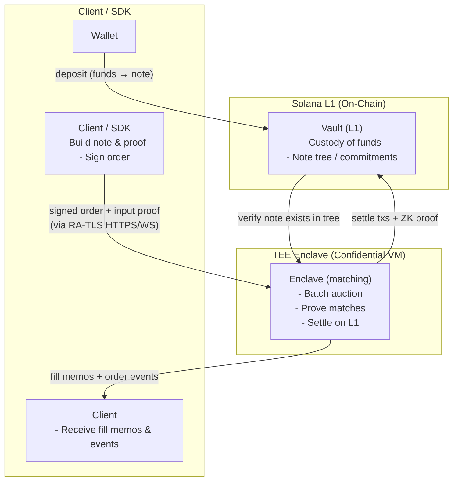

# Trade Flow

:::info[TL;DR]
You deposit funds into the on-chain vault as a private **note**. You submit a
hidden order, backed by that note, to the enclave. The enclave matches it in a
batch auction and proves the matches, then settles them on Solana itself - moving
value between notes against a zero-knowledge proof. Your order never becomes a
Solana transaction; only the *result* settles.
:::

## Order-to-settlement lifecycle

## Step by step

| Step | Where | What happens |
|---|---|---|
| **1. Deposit** | Wallet → Vault | You deposit tokens into the on-chain vault. The deposit becomes a UTXO-style **note** - a commitment added to the on-chain Merkle tree. Owner, value, and token are sealed inside the commitment. |
| **2. Build the order** | Client / SDK | The SDK selects a spendable note, generates a zero-knowledge **input proof** that the note is in the tree and yours, assembles the continuation **anchor pool**, and signs the canonical order body with your **trading key**. |
| **3. Submit** | Client → Enclave | The signed order is sent over RA-TLS (REST or the trading socket). It never touches a Solana transaction. The enclave verifies the signature and that the note opening matches the committed note. |
| **4. Match** | Enclave | Each batch, the engine collects crossing orders and clears them at a single **oracle-anchored price** (see [Clearing Price](../trading-primitives/clearing-price)). Orders from the same trading key never match each other. |
| **5. Prove** | Enclave | The engine generates a zero-knowledge proof that the batch of matches is conservation-correct and bound to the committed notes, within the circuit-breaker band. |
| **6. Settle** | Enclave → Vault (L1) | The engine submits the settlement transactions to Solana itself: it locks the input notes, verifies the batch proof on-chain, executes the atomic transfers, and reclaims the batch marker. Funds move; new notes appear in the tree. |
| **7. Notify** | Enclave → Client | The engine pushes order-lifecycle events ([Orders Channel](../websocket/orders-channel)) and fill memos ([Fills Channel](../websocket/fills-channel)) so you can recover and spend your change and output notes. |

## What is on-chain and what is not

| On-chain (public, verifiable) | Off-chain (private, in the enclave) |
|---|---|
| Custody of funds | Order intent (side, size, limit price) |
| The Merkle tree of note commitments | The order book |
| Nullifier and consumed-note sets | The matching computation |
| The Groth16 proof verifier | The clearing-price calculation |
| Every settlement transaction + its proof | The link from a trade to a wallet |

The chain sees that *value moved correctly between committed notes*, proven by
zero knowledge. It never sees the orders that produced the trade. The enclave sees
the orders, but cannot move funds except by submitting a proof the chain
independently verifies.

## Why your order never hits the chain

A common misconception is that a private DEX "encrypts orders on-chain." Darknyx does
something stronger: **your order is never a transaction at all.** It lives only
inside the attested enclave. What lands on Solana is the *settlement* - a transfer
of value between notes, accompanied by a proof that the transfer is correct. That
is why an observer indexing Solana forever still learns nothing about your orders:
there is nothing about them on the chain to index.

See [Privacy & Attestation](./privacy-and-attestation) for how you verify the
enclave is the real engine, and [Settlement](./settlement) for the on-chain
pipeline in detail.
