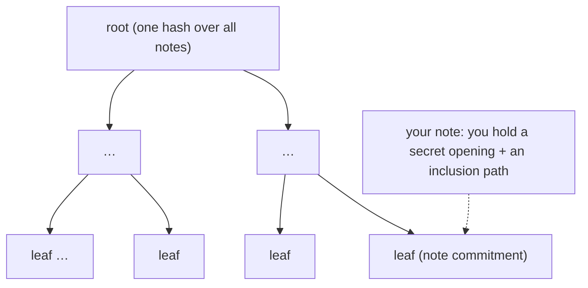
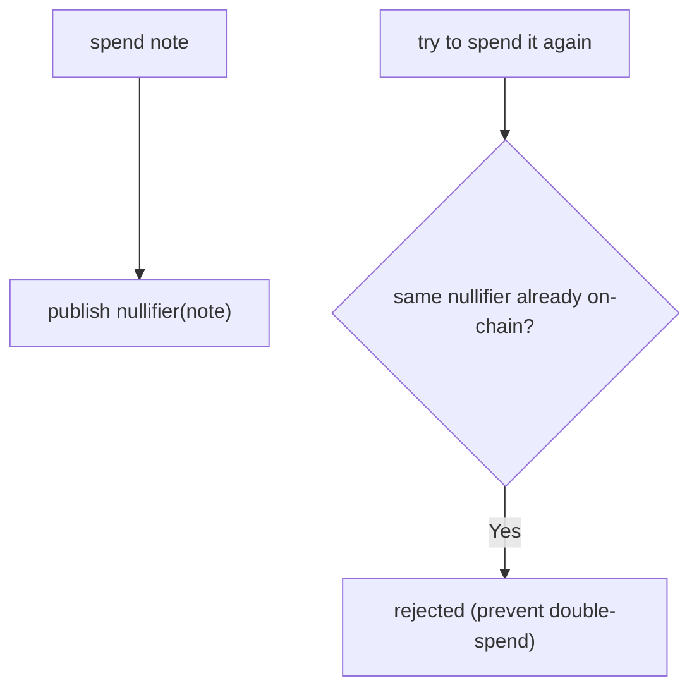
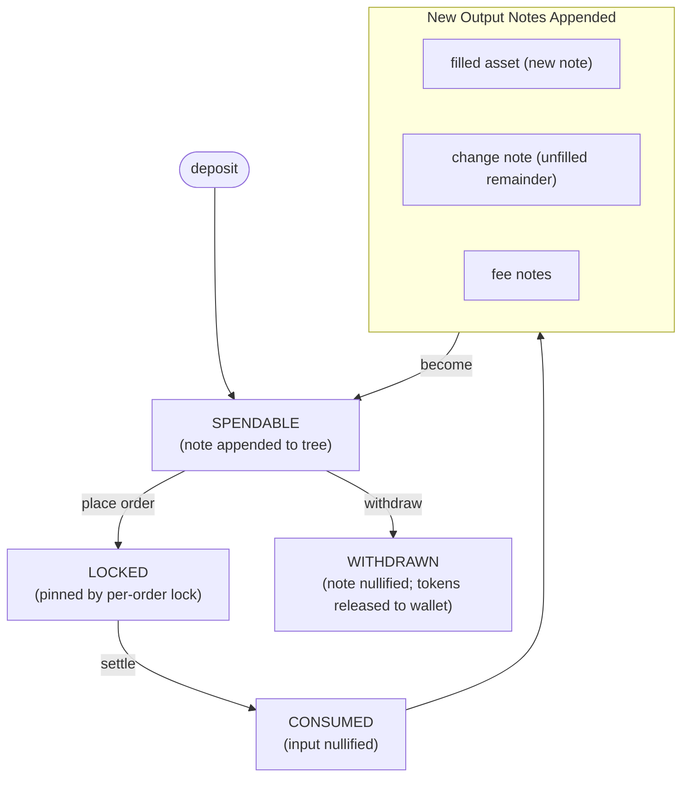

# Shielded Pool

:::info[TL;DR]
Your balance on Darknyx is a set of **notes** - UTXO-style values committed on-chain as
Poseidon hashes that seal the owner, amount, and token. The commitments live in a
Merkle tree; spending a note publishes a **nullifier** that prevents reuse. You
prove ownership and inclusion in zero knowledge, so the chain enforces correctness
without ever learning what you hold.
:::

## Notes, not balances

A custodial venue stores your balance as a number in a database. Darknyx stores it as
a set of **notes**. A note is a commitment - a Poseidon hash - to four things:

```text
note commitment = Hash( token mint, amount, owner, inner_hash )
```

The commitment reveals none of its inputs. From the outside, a note is an opaque
32-byte leaf in a tree. Only the owner, with their spending key, can recognize
which notes are theirs and read the amounts. This is what makes position privacy a
property of the data structure rather than a policy.

## The Merkle tree

Every note commitment is appended to an on-chain incremental **Merkle tree**. The
tree's root is a single hash summarizing every note that exists. To use a note you
prove, in zero knowledge, that it is a leaf under the current root - without
revealing *which* leaf.



The tree is **sharded** for settlement throughput - several independent subtrees,
each with its own root - but conceptually it is one accumulator of all
commitments. You read roots and inclusion paths through the
[Merkle Proofs](../account/merkle-proofs) endpoints.

## Nullifiers prevent double-spends

A commitment proves a note *exists*; a **nullifier** proves it has been *spent*.
When a note is consumed - by a settlement or a withdrawal - a unique nullifier
derived from it is published on-chain. The nullifier is computed so that:

- it is **unlinkable** to the note commitment (publishing it does not reveal which
  note was spent), yet
- it is **deterministic** - spending the same note twice produces the same
  nullifier, and the second spend is rejected because the nullifier already
  exists.



This is the double-spend guard, and it is enforced on-chain independently of the
enclave: even a misbehaving engine cannot spend your note twice, because the second
attempt collides with the published nullifier.

## The amount-independent inner hash

Each note's commitment and its nullifier are both anchored on a single
amount-independent value, the note's **inner hash**. Decoupling the nullifier from
the (amount-dependent) commitment is what lets you **pre-supply** the secret
material for your future change notes - the continuation
[anchor pool](../trading-primitives/anchor-pool) - so a partially-filled order can
re-lock its remainder without a round-trip. The inner hash is the hinge that makes
private, resting, repeatedly-fillable orders possible.

## Spending in zero knowledge

To move value out of the pool - settling a trade or withdrawing - you produce a
zero-knowledge proof that:

1. the input note is a leaf under a recent tree root (it exists and is yours),
2. the output notes conserve value (nothing is created or destroyed), and
3. the spend is bound to the correct owner.

The on-chain program verifies the proof and applies the result: it publishes the
input's nullifier, appends the output commitments, and (for a withdrawal) releases
tokens. The chain learns that *a* valid spend happened - never whose, or for how
much beyond what a withdrawal necessarily reveals.

## The lifecycle, end to end



Every transition is gated on-chain by a distinct record - a wallet entry, a
nullifier, a consumed-note marker, a note lock - so a note can never be used twice
regardless of what the engine does. See [Account Model](../account/account-model)
for how you reconstruct your spendable set from this, and
[Settlement](./settlement) for the on-chain spend pipeline.
