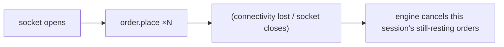

# WebSocket Trading

:::info
`/ws/trading` is a bidirectional socket for order submission. Stream framed
`order.place` / `order.cancel` / `order.modify` requests and receive one reply
per frame - dispatched to the **same** intake and verification the REST endpoints
use. The wins over REST: one warm, pre-authenticated connection (no TLS + bearer
round-trip per request) and **cancel-on-disconnect** for market makers.
:::

## Connect

```text
wss://<gateway-host>/ws/trading?token=<access_token>
```

The socket self-authenticates with the bearer token as `?token=` (an
`Authorization: Bearer` header is also accepted). To enable cancel-on-disconnect,
add `&cancel_on_disconnect=true`.

```text
wss://<gateway-host>/ws/trading?token=<access_token>&cancel_on_disconnect=true
```

:::caution[The order signature is still required]
Authenticating the socket establishes *who is connected*, not *who owns an
order*. Every `order.place` / `order.cancel` / `order.modify` frame still carries
the per-order **trading-key signature** (the same one the REST endpoints require).
An authenticated socket cannot move another key's orders.
:::

## Message format

Every frame is JSON, tagged by `op`. Requests may carry a `request_id`, which the
reply echoes so a client can correlate responses on the multiplexed socket.

### Request frames

| `op` | Fields | Equivalent REST |
|---|---|---|
| `order.place` | `request_id?`, `params` (a full [Place Order](../orders/place-order) body) | `POST /orders` |
| `order.cancel` | `request_id?`, `order_id`, `params` (`trading_key`, `cancel_nonce`, `trading_key_signature`) | `DELETE /orders/{id}` |
| `order.modify` | `request_id?`, `order_id`, `params` (a [Modify Order](../orders/modify-order) body) | `PUT /orders/{id}` |
| `ping` | `request_id?` | - |

```json
{ "op": "order.place", "request_id": "r1", "params": { "symbol": "SOL-USDC", "side": "bid", "…": "…" } }
```

### Reply frames

| `op` | Fields | Meaning |
|---|---|---|
| `order.place` | `request_id?`, `result` | Order accepted; `result` mirrors the REST place response. |
| `order.cancel` | `request_id?`, `result` | Order cancelled. |
| `order.modify` | `request_id?`, `result` | Order modified. |
| `pong` | `request_id?` | Heartbeat reply. |
| `error` | `request_id?`, `code`, `message` | A frame failed. `code` is the HTTP-equivalent status (`400`, `403`, `404`, `409`, `503`) and `message` the same reason the REST path would have returned. |

```json
{ "op": "order.place", "request_id": "r1", "result": { "order_id": "aa…01", "status": "accepted", "arrival_slot": 309482113 } }
```

```json
{ "op": "error", "request_id": "r2", "code": 403, "message": "trading_key_signature does not verify against the canonical body" }
```

## Cancel-on-disconnect

When you connect with `?cancel_on_disconnect=true`, the engine tracks the orders
placed on **this** socket and, when the socket closes, cancels the ones still
resting. This protects a market maker that loses connectivity from leaving stale
quotes crossing.

The teardown is a server-initiated cancel using each order's own booked key - it
needs no client signature, because the order was placed on this authenticated
session and a cancel only un-rests an order (it never settles or moves funds).



Orders that have already filled, expired, or been cancelled are left as-is; only
still-resting orders from this session are swept.

## Heartbeat

Send a `ping` frame periodically to keep the connection live and detect a
half-open socket; the server replies `pong`. Transport-level WebSocket pings are
also answered.

## Example

```javascript
const ws = new WebSocket(`${WSS}/ws/trading?token=${TOKEN}&cancel_on_disconnect=true`);
let id = 0;
const next = () => `r-${++id}`;

ws.onopen = () => {
  ws.send(JSON.stringify({ op: "order.place", request_id: next(), params: order }));
};

ws.onmessage = (e) => {
  const msg = JSON.parse(e.data);
  if (msg.op === "error") console.error("rejected", msg.code, msg.message);
  else if (msg.op === "order.place") console.log("accepted", msg.result.order_id);
};

setInterval(() => ws.send(JSON.stringify({ op: "ping", request_id: next() })), 20000);
```

## REST vs. WebSocket

| Aspect | REST | WebSocket trading |
|---|---|---|
| Latency | Higher (TLS + HTTP per request) | Lower (one persistent socket) |
| Auth | Bearer header per request | Token once at connect; order signature per frame |
| Disconnect safety | None | Optional cancel-on-disconnect |
| Best for | One-off calls, cold starts | Long-running trading clients, market makers |

For live order *state* (fills, expiries), pair this socket with the
[Orders Channel](./orders-channel) and the [Fills Channel](./fills-channel).
