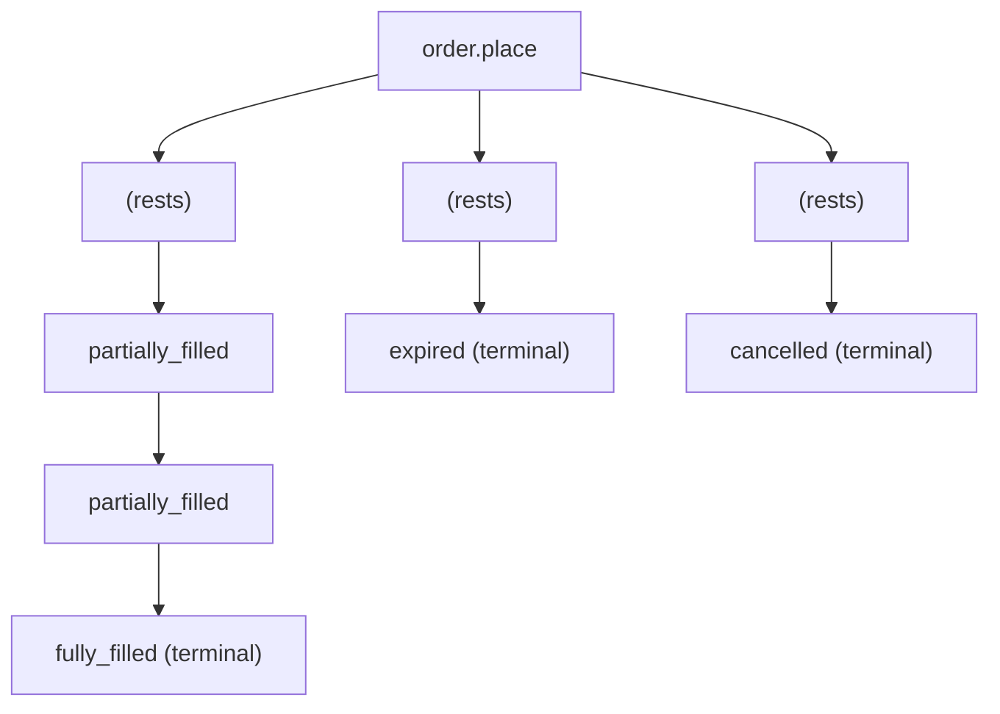

# Orders Channel

:::info[TL;DR]
`/ws/orders` streams **order-lifecycle events** for your account: each time one
of your orders changes state — partial fill, full fill, cancellation, expiry — the
engine pushes an event. The stream is per-account: you only ever see your own
orders. Use it instead of polling `GET /orders/{id}`.
:::

## Connect

```text
wss://<gateway-host>/ws/orders?token=<access_token>
```

Self-authenticating with the bearer token as `?token=` (the `Authorization`
header is also accepted). The stream is **per-account**: events are routed to you
by the order-id → account mapping the engine records at intake, so a subscriber
only ever receives events for orders it placed.

## Event shape

Each message is a JSON object describing one state transition:

```json
{
  "order_id": "aa00000000000000000000000000000001",
  "kind": "partially_filled",
  "filled_quantity": 3000000,
  "new_amount": 7000000,
  "new_note_amount": 1050000000
}
```

| Field | Type | Present when | Description |
|---|---|---|---|
| `order_id` | string | always | The 16-byte order id, hex. |
| `kind` | string | always | The transition: `partially_filled`, `fully_filled`, `cancelled`, or `expired`. |
| `filled_quantity` | integer | on fills | Cumulative filled quantity. |
| `new_amount` | integer | on partial fill | The residual base amount still resting. |
| `new_note_amount` | integer | on partial fill | The residual collateral-note value after the fill re-locked the remainder. |

## Event kinds

| `kind` | Terminal? | Meaning |
|---|---|---|
| `partially_filled` | No | Part of the order filled; the remainder keeps resting (re-locked into a new note). |
| `fully_filled` | Yes | The order filled completely. |
| `cancelled` | Yes | The order was cancelled — by you, by a modify, or on session disconnect. |
| `expired` | Yes | The order reached its `expiry_slot` without fully filling. |

A **terminal** event is the order's last; after it, the order has left the book
and produces no further events.

## Event flow



A partial fill carries the residual size so you always know how much is still
working; the matching fill *memo* (which note the change went into) arrives on
the [Fills Channel](./fills-channel).

## Gap recovery

If a slow consumer falls behind the per-account buffer, the server closes the
socket with code **1011**. On a 1011 close, reconnect and reconcile any orders you
care about with `GET /orders/{order_id}` — the channel is a low-latency notifier,
not a durable log.

## Example

```javascript
const ws = new WebSocket(`${WSS}/ws/orders?token=${TOKEN}`);

ws.onmessage = (e) => {
  const ev = JSON.parse(e.data);
  switch (ev.kind) {
    case "partially_filled":
      console.log(`partial: ${ev.filled_quantity} filled, ${ev.new_amount} resting`);
      break;
    case "fully_filled":
      console.log(`filled: ${ev.order_id}`);
      break;
    case "cancelled":
    case "expired":
      console.log(`${ev.kind}: ${ev.order_id}`);
      break;
  }
};

ws.onclose = (e) => {
  if (e.code === 1011) reconnectAndReconcile();
};
```
