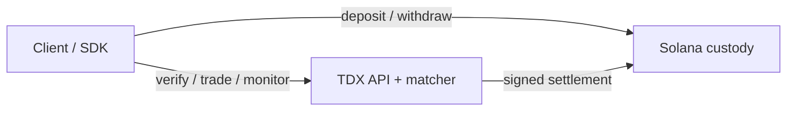

# Architecture overview

> Three layers, two boundaries, one trust chain.
> Custody on Solana, matching inside an Intel TDX enclave, clients
> running zero-knowledge proofs locally. Every cross-layer message
> is either an on-chain transaction or a TEE-attested API call;
> there are no hidden side channels.

---

## The three layers

### Layer 1 — Custody (on Solana)

The on-chain custody layer records user funds, note commitments,
spent-note tracking, and settlement authorization.
Users never hand custody to the TEE or the API server.

For integrators, the important guarantee is:

- deposits and withdrawals are direct Solana transactions;
- notes cannot be spent twice;
- settlement is accepted only when it is signed by the registered TEE key;
- users can still withdraw directly even if the matching API is unavailable.

### Layer 2 — Matching (inside a TDX CVM)

A single process (`darknyx-tee`) runs inside a TDX confidential VM and handles:

- **Public + private API surface** (`/info`, `/attestation`, `/orders`, `/settlement/status/...`)
- **Order matching loop** on fixed intervals
- **Oracle price ingestion**
- **Settlement submission to Solana**

For users/integrators, the key point is simple: the TEE performs matching privately, while final settlement and custody guarantees are enforced on-chain.

The boundary between this layer and Solana is the settle pipeline
(five transactions per batch, documented in
[settlement-pipeline](./settlement-pipeline.md)). The boundary
between this layer and clients is the HTTPS API (documented in
[api-and-integration](./api-and-integration.md)).

### Layer 3 — Client (TypeScript SDK)

The SDK is the user-side bridge. It:

1. Verifies the TEE before sending private order intent.
2. Authenticates with the API and manages bearer-token refresh.
3. Builds and signs order requests.
4. Reads account, note, tree, and settlement state.
5. Submits Solana transactions through the user's preferred RPC.

---

## Component map

| Component | What it handles | User-facing interface |
|---|---|---|
| **Client / SDK** | TEE verification, auth, order signing, account reads, Solana tx submission | Wallet + SDK/API calls |
| **TDX API + matcher** | Private order intake, matching, account/tree reads, realtime updates, settlement submission | HTTPS + WebSocket |
| **Solana custody** | Deposits, withdrawals, note state, spent-note tracking, settlement authorization | Solana RPC / returned tx signatures |

---

## The cross-layer messages

### Client → Solana

Users interact with Solana directly for custody operations:

1. **Create/open account state** — establish the user's note identity.
2. **Deposit** — move funds into a private note.
3. **Withdraw** — spend a note back to a normal wallet destination.

These flows do not require trusting the matching API.

### Client → TEE

API interactions are user-facing and documented by `docs/tee-api-openapi.yaml`:

1. **Verify** — `GET /attestation`, `GET /info`, and `/evidences/*`.
2. **Authenticate** — `POST /auth/token`.
3. **Trade** — `POST /orders`, `DELETE /orders/{order_id}`, `POST /orders/mass-quote`.
4. **Monitor** — `GET /orders/{order_id}`, `GET /account`, `GET /settlement/status/{batch_id}`.
5. **Realtime** — `/v1/stream` WebSocket channels for orders, fills, account, settlement, and tree updates.

### TEE → Solana

When a batch matches, the TEE submits settlement to Solana. Clients
do not need to construct these transactions themselves; they track
progress through `GET /settlement/status/{batch_id}` and verify the
returned transaction signatures if needed.

---

## Why this shape

The three-layer split is not arbitrary. Each boundary is doing
real work:

### Custody at the bottom

If the matching layer or the client layer is compromised, funds
should still be safe. The vault program is the floor: no withdraw
without a VALID_SPEND proof; no settle without a VALID_MATCH_BATCH
proof; no settle without the registered TEE signature. The TEE
itself **cannot exit funds** without a user proof — the worst it
can do is censor (refuse to match) or front-run within a single
batch tick, both of which are limited by the matcher's uniform
clearing price + frequent batch auctions design.

### Matching in the middle

Matching is fundamentally stateful and latency-sensitive. Running
it on-chain (or on a rollup, or on a sidechain) leaks every order
to a sequencer or validator. Running it inside an attested enclave
keeps order intent invisible from everyone except the enclave's
compiled image, which is itself fixed by `compose_hash` and can
only sign settles for its own measurements.

### Clients on top

User-side ZK proof generation keeps the spending key off both the
TEE and the chain. The cryptographic chain of trust from "I have a
seed phrase" to "I own this note" only ever exists inside the
user's device.

---

## What's on-chain vs in-TEE vs client-side

| Concern | Location | Why |
|---|---|---|
| Token custody | On-chain (vault SPL token accounts) | Solana enforces transfers atomically; the only authority is the vault program itself |
| Merkle tree of note commitments | On-chain (vault state account) | Auditable by any observer; allows trustless withdraw without a centralized indexer |
| Spent-note tracking | On-chain | Prevents double-spending |
| Order book | In-TEE | Keeps order intent private until settlement |
| Account/API session state | In-TEE | Enables rate limits, auth, order state, and WebSocket updates |
| Tree mirror | In-TEE, verifiable against Solana | Faster account/proof reads for clients |
| User spending key | Client-side only | Never sent to the API |
| User trading key | Client-side only | Signs order intent without exposing custody keys |

The pattern: **whatever needs to be trusted goes on-chain;
whatever needs to be private goes in-TEE; whatever needs to remain
the user's secret stays on their device.**

---

## What the rest of these docs cover

- [Custody layer](./custody-layer.md) — the vault program, the note
  system, the Merkle tree, the on-chain instructions in detail.
- [Matching layer](./matching-layer.md) — the in-TEE matcher
  architecture, the frequent-batch-auction algorithm, oracle
  integration, why TDX specifically.
- [Cryptography](./cryptography.md) — the key derivation chain, the
  Poseidon hash spec, the six ZK circuits, replay protection.
- [Trust model](./trust-model.md) — the attestation chain, multisig
  governance, threat model, what a malicious TEE can and cannot do.
- [Settlement pipeline](./settlement-pipeline.md) — the five-tx
  batched flow, the 1232-byte size budget, the ALT story.
- [API & integration](./api-and-integration.md) — endpoint groups,
  authentication, order lifecycle, WebSocket channels, and settlement polling.

