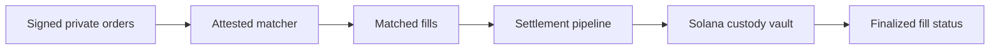

# The matching layer

> Darknyx matches private orders inside an attested Intel TDX environment.
> Users submit signed order intent through the API, the matcher batches orders
> at a uniform clearing price, and successful fills move into the settlement
> pipeline described in the next page.

---

## What the matching layer does

The matching layer is responsible for turning private order intent into matched
fills without publishing the order book on-chain. It receives signed orders,
groups them into frequent batches, computes a clearing price, and emits fills
that can be settled by the custody layer.

For users and integrators, the important properties are:

1. **Private intent.** Order side, size, and limit price are not broadcast to
   validators, sequencers, or other traders.
2. **Verifiable execution.** The TEE signs settlement payloads with a key tied to
   its attested measurement.
3. **Fair batching.** Orders in the same batch clear at one price with FIFO
   priority at each price level.
4. **Fast feedback.** Clients can observe order status, fills, and settlement
   progress through REST and WebSocket APIs.

---

## Why a TEE

A public order book gives strong transparency but weak privacy: everyone can see
intent before settlement. Pure cryptographic matching can offer stronger privacy,
but today it is too slow and expensive for an active order book.

A TEE gives Darknyx a practical middle ground:

| Requirement | How Darknyx handles it |
|---|---|
| Keep orders private | Orders are decrypted only inside the attested environment |
| Avoid trusting the operator blindly | Clients can verify the TEE measurement and registered signer |
| Match quickly | Matching runs at normal CPU speed instead of waiting on multi-party protocols |
| Settle on Solana | Matched fills are handed to the on-chain custody pipeline |

The TEE is not treated as magic. The trust model depends on attestation, signer
registration, settlement proofs, and the ability for users to withdraw from the
vault. See [trust model](./trust-model.md) for the full chain.

---

## Why Intel TDX

Darknyx uses Intel TDX because it provides a confidential VM model: the matcher
runs as a normal service inside an isolated virtual machine while the host cannot
inspect its memory. This is a better fit for an order-matching service than older
enclave models that require unusual programming constraints.

TDX also has a practical cloud deployment path through Phala Cloud and dstack,
which provides attestation and key-derivation APIs without forcing users to trust
a custom operator-controlled verification service.

---

## Matching model

Darknyx uses a **frequent-batch auction**:

1. Signed orders accumulate for a short interval.
2. The matcher computes the price that maximizes executable volume while
   respecting user limits.
3. All compatible orders in the batch clear at the same price.
4. If multiple orders compete at the same price level, earlier orders have
   priority.
5. The resulting fills are sent to the settlement pipeline.

This model reduces the value of front-running because there is no continuous
first-in-line race within a batch. Everyone who clears in the same batch receives
the same clearing price.

---

## Batch cadence

The default cadence is designed to feel live for traders while giving settlement
time to keep up. Liquid markets can run faster; thinner markets can run slower.
The cadence is a market parameter, not a fixed protocol assumption.

For integrators, the takeaway is simple: order status changes are asynchronous.
After submitting an order, clients should listen for order and fill updates over
WebSocket or poll the order endpoint until the order is filled, cancelled,
expired, or rejected.

---

## Oracle guardrails

The matcher uses Pyth market data as a sanity check around clearing prices. If a
batch would clear too far away from the accepted oracle range, the batch is
skipped and orders remain open instead of settling at an unsafe price.

This guardrail is especially useful for thin markets, stale feeds, and temporary
market dislocations. It does not expose order intent; it only constrains whether
a computed clearing price is safe enough to use.

---

## Settlement handoff

Matching and custody are intentionally separate:

The matcher decides which orders cross. The custody layer decides whether funds
can move. Settlement still requires the relevant proofs, note locks, TEE
signatures, and on-chain state transitions described in
[settlement pipeline](./settlement-pipeline.md).

---

## Self-trade prevention

Darknyx prevents a trader from unintentionally matching against themselves by
default. Integrators can expose this as a clear account or order-level policy:
most users should leave self-trade prevention enabled, while specialized market
making strategies may need explicit controls.

---

## Performance expectations

The matching step itself is designed to be fast; user-visible latency is usually
dominated by batching cadence, network round trips, and Solana settlement
confirmation. Applications should present matching and settlement as a lifecycle
rather than as a single synchronous request.

A typical integration should show:

| State | Meaning |
|---|---|
| Accepted | The TEE accepted the signed order |
| Open | The order is live and eligible for a future batch |
| Partially filled | Some quantity matched and settlement is progressing |
| Filled | The order fully matched |
| Settled | The resulting custody movement finalized on-chain |
| Cancelled / expired | The order is no longer eligible to match |

---

## Integrator surface

Integrators do not call the matcher directly. They use:

- `POST /orders` to place signed order intent;
- `DELETE /orders/{order_id}` to cancel;
- `POST /orders/mass-quote` for atomic cancel-replace batches;
- `GET /orders/{order_id}` and WebSocket `orders` / `fills` channels to observe
  matching results.

See [API & integration](./api-and-integration.md) for the user-facing contract.
