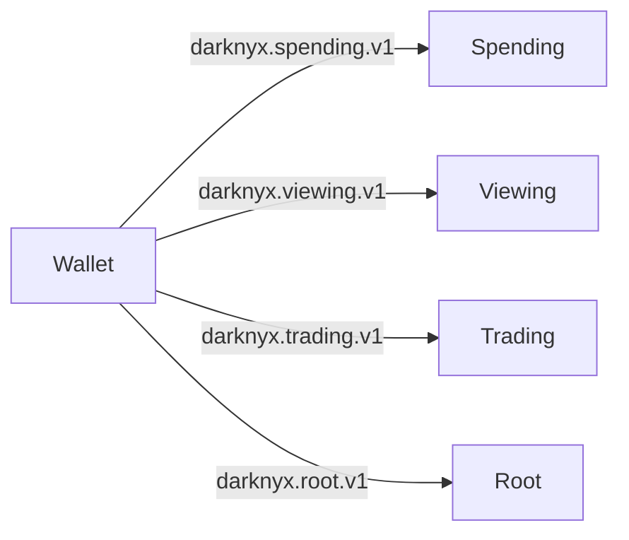

# Cryptography

> Three primitives carry the cryptographic load: BN254 Poseidon
> (for everything Merkle-tree-shaped), Ed25519 (for signatures),
> and Groth16 over BN254 (for the six ZK circuits). The
> byte-equality contract between host-side Rust, on-chain Solana
> BPF, and in-browser TypeScript is enforced by parity tests
> running in CI on every commit.

---

## Why these primitives

| Primitive | Use | Why this one |
|---|---|---|
| **Poseidon over BN254** | Note commitments, nullifiers, Merkle tree, leaf hashes, user commitments, key derivation chain steps | Designed for SNARK efficiency: ~30× fewer constraints per hash than SHA-256 inside a circuit. Native Solana support via `solana_poseidon::hashv` syscall (cheap on-chain verification). |
| **Ed25519** | TEE signing key, user trading keys, JWT bearer tokens | Standard signing scheme. Same key format Solana uses natively. Constant-time implementations widely available. |
| **Groth16 over BN254** | All six ZK circuits | Smallest proof size (~200 bytes); fastest on-chain verification on Solana via `groth16-solana` (an open-source BPF-friendly verifier we audit). Mature tooling: circom + snarkjs for circuit compilation. |

The BN254 / Groth16 combination is the de facto standard for
SNARK applications on Solana. Newer curves (BLS12-381, Pasta) and
newer proof systems (Plonk, Halo2, Stark) have advantages on
paper, but no production-grade BPF-friendly verifier exists for
them yet. We have a path to switch curves later if needed — the
abstraction layer in `darkpool-crypto` would absorb the change —
but BN254 is the right choice today.

---

## The key derivation chain

Each Darknyx user maintains four distinct keys, derived in a chain
from a single seed:



| Key | Type | Purpose |
|---|---|---|
| Wallet | Ed25519 | Deterministic seed source and Solana transaction signer |
| Spending | 32-byte field scalar | Proves note ownership; never sent to the TEE |
| Viewing | 32-byte field scalar | Decrypts note memo data for portfolio recovery |
| Trading | Ed25519 keypair | Signs orders sent to the TEE |
| Root | 32-byte field scalar | Derives per-note owner randomness |

The four-key separation is what makes the privacy properties work:

- The **wallet** is on-chain (anyone can see it). It signs custody
  transactions (deposit, withdraw, create_wallet).
- The **spending key** is on-device only. Compromise lets the
  attacker withdraw the user's notes.
- The **viewing key** is on-device only. Compromise lets the
  attacker see the user's note plaintexts (decrypt the deposit
  memos) — but not spend.
- The **trading key** is generated fresh per session (or pinned
  long-term, user's choice). Compromise lets the attacker submit
  orders signed as this user; the worst they can do is flood the
  TEE with cancellable orders, since the trading key alone can't
  unlock notes.

The derivation labels are stable and versioned. A future v2
derivation (different labels) lets users migrate to a different
key shape without invalidating their old notes.

---

## The user commitment

When a user calls `create_wallet`, they register a single 32-byte
value:

```text
user_commitment = Poseidon2(spending_key, r_owner)
```

where `r_owner` is a per-user random 32-byte value derived from
the root key + the wallet pubkey. This commitment becomes the
user's identity for note-ownership proofs.

Every note's `owner_commit` field stores this same value. The
VALID_SPEND circuit checks two things:

1. The spender knows the spending key and the `r_owner` such that
   `Poseidon2(spending_key, r_owner) == owner_commit` — proves
   knowledge.
2. The spender can compute the nullifier — proves they're the
   one and only intended spender.

Two users will produce different `r_owner` values for the same
spending key (because `r_owner` depends on the wallet pubkey),
which means different `user_commitment` values. No collision
across users; full deterministic recovery for the same user.

---

## The note commitment

Each note's commitment hashes seven inputs:

```text
note = Poseidon7(
  DOMAIN_NOTE (= 2),
  token_mint_lo,
  token_mint_hi,
  amount,
  owner_commit,
  nonce,
  blinding,
)
```

- `DOMAIN_NOTE = 2` is the domain-separation tag (distinct from
  the other Poseidon uses).
- `token_mint_lo` / `token_mint_hi` split the 32-byte Solana mint
  pubkey into two 128-bit halves. The split is necessary because
  BN254 Fr elements can hold at most 254 bits; a single 32-byte
  value might be out of range.
- `amount` is the token amount in mint-native units (u64).
- `owner_commit` is the user's `user_commitment`.
- `nonce` is a per-note random Fr value.
- `blinding` is a per-note random Fr value.

The `nonce + blinding` pair is what makes notes unlinkable. Two
notes with the same `(mint, amount, owner_commit)` produce
different commitments because `(nonce, blinding)` differ. An
on-chain observer seeing two notes can't tell whether they
belong to the same user, hold the same amount, or were created
in related operations.

---

## The nullifier

The nullifier for a note is:

```text
nullifier = Poseidon2(spending_key, note_commitment)
```

The vault stores a `NullifierEntry` PDA per used nullifier. When
a withdraw lands, the verifier:

1. Checks the VALID_SPEND proof (proves the spender knows the
   spending key and the note's plaintext).
2. Derives the nullifier from the proof's public inputs.
3. Allocates the `NullifierEntry` PDA at the derived address.

Step 3 is where double-spend protection lives. If the nullifier
has been used before, the PDA allocation fails with Anchor's
`init` constraint error. No nullifier set check needed; the
Solana runtime does it for us.

The Poseidon2 construction binds the nullifier to both the
spender's key and the specific note. Two notes with different
plaintexts produce different nullifiers (so spending one doesn't
mark the other as spent), and two users with different spending
keys can't grief each other (only the rightful owner can
produce the nullifier for their notes).

---

## Poseidon spec and parity

The Poseidon hash we use is the **BN254 Poseidon with x^5 S-box
and Circom-compatible parameters**:

- Curve: BN254 (alt_bn128)
- Field: Fr (254-bit prime field)
- S-box: x^5
- Maximum arity: 12 (= 13 inputs total including the 1 fixed
  state slot)
- Rounds: per-arity round counts from the Poseidon spec, the same
  numbers `circomlib/circuits/poseidon.circom` uses

The implementations:

| Environment | Implementation | Verified byte-equal with |
|---|---|---|
| Host-side Rust | `light-poseidon` (LightProtocol's port) | Reference test vectors + the on-chain syscall |
| Solana on-chain | `solana_poseidon::hashv` (Solana's native syscall) | `light-poseidon` (via litesvm tests) |
| In-circuit (Groth16 witness) | `circomlib`'s Poseidon template | The above two (via parity tests) |
| In-browser TypeScript | `circomlibjs` (JavaScript port of circomlib) | Host-side Rust (via the SDK's `poseidon-parity.test.ts`) |

The byte-equality property is enforced by automated parity checks
for every Poseidon use case used by the protocol.

---

## The core ZK checks

Darknyx uses Groth16 proofs to enforce custody and settlement rules
without revealing private note data. For users and integrators, the
important checks are:

### 1. VALID_WALLET_CREATE

Proves the `user_commitment` is correctly formed:
`user_commitment == Poseidon2(spending_key, r_owner)`.
Used by `create_wallet`. ~50 constraints.

### 2. VALID_INPUT

Proves a deposit's note commitment is correctly formed for the
declared `(token_mint, amount)`. Used by `deposit` and (relayed
by the TEE) by `lock_note`. ~120 constraints.

### 3. VALID_SPEND

Proves the spender knows the spending key + note plaintext,
generates the correct nullifier, and creates the correct
change-note commitment (if the withdrawal amount is less than
the note's full value). Includes a Merkle inclusion path against
a recent root. ~3,200 constraints (dominated by the
depth-20 Merkle path).

### 4. VALID_MATCH_BATCH

Proves a matched batch is valid before settlement lands on-chain.
The proof binds the batch to a Merkle root, and settlement consumes
that root when finalizing matched fills.

---

## Domain separation

Every Poseidon use case has a unique single-byte domain tag at
position 0 of the input:

| Tag | Use |
|---|---|
| 1 | User commitment (`Poseidon2`) |
| 2 | Note commitment (`Poseidon7`) |
| 3 | Nullifier (`Poseidon2`) |
| 20 | VALID_MATCH_BATCH leaf inner hash (`Poseidon12`) |
| 21 | VALID_MATCH_BATCH leaf top hash (`Poseidon9`) |
| 22 | VALID_MATCH_BATCH internal Merkle node (`Poseidon3`) |

Domain separation prevents cross-use collisions. A nullifier and a
user commitment that happen to have the same input bytes still
produce different hashes because their domain tags differ. The
on-chain verifier always uses the right tag for the use case; the
in-circuit version does too. Misalignment would silently produce
wrong hashes; domain separation surfaces it as an inclusion-path
mismatch instead.

---

## Replay protection

Every action that could be replayed has an on-chain mechanism that
makes replay impossible:

| Action | Replay defense |
|---|---|
| Reuse an old VALID_SPEND proof | Nullifier PDA — second use of the same proof's nullifier fails at PDA init |
| Reuse an old VALID_INPUT proof at lock time | `NoteLock` PDA seeded by the note commitment — second lock of the same note fails at PDA init |
| Reuse an old VALID_WALLET_CREATE proof | `WalletEntry` PDA seeded by the user_commitment — second create of the same wallet fails at PDA init |
| Reuse an old VALID_MATCH_BATCH proof | `BatchValidityMarker` PDA seeded by the batch Merkle root — same batch root produces the same PDA address, init fails on second use |
| Reuse an old TEE settle signature | The canonical payload hash binds the match's `batch_slot`, which is monotonically increasing; signatures over a stale slot are rejected by `expiry_slot` checks |
| Submit the same order twice to the TEE | `(trading_key, arrival_nonce)` deduplication in the order handler |

The pattern is uniform: every operation that consumes user state
allocates a PDA whose address is a deterministic function of the
state being consumed. The Solana runtime's "account already in use"
error path catches replay attempts without the program code having
to track its own seen-set.

## A note on quantum

Like every other production SNARK system, Darknyx's cryptography is
not quantum-resistant. BN254 elliptic-curve operations break under
Shor's algorithm; Ed25519 signatures break under the same; Poseidon
itself is fine (it's a hash, not a key-exchange primitive), but
the public-key operations it sits inside are not.

The state of the art for post-quantum SNARKs (lattice-based,
hash-based) does not yet have BPF-friendly verifiers comparable to
`groth16-solana`. We track this space and have an upgrade path in
mind if practical post-quantum proving systems become viable for
Solana.

The mitigating factor: any user holding Darknyx-deposited funds can
withdraw at any time, well before a credible quantum threat
emerges. No long-term funds are required to sit in the protocol.

