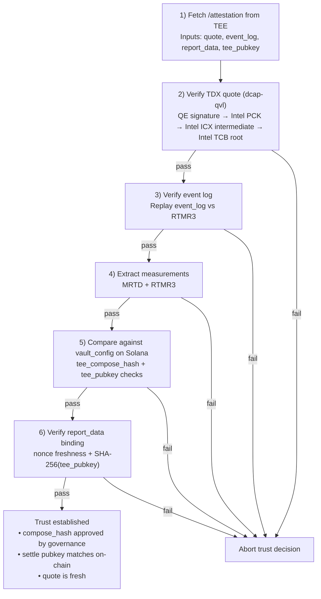

# Trust model

> Darknyx's matching layer runs inside an Intel TDX Confidential VM
> whose compiled image is pinned on Solana through a multisig-
> governed rotation ceremony. Clients verify the enclave's
> attestation chain against Intel's TCB root before trusting any
> data from it. The vault program enforces, on-chain, that only
> the registered TEE pubkey can sign settlement transactions —
> and that pubkey can only be rotated by the multisig.

---

## What "trust" means here

When we say "you trust the TEE," we mean exactly five things:

1. You trust **Intel's TDX hardware** to enforce memory encryption
   and remote attestation. (Mitigation: this is the same trust
   foundation used by Apple, AWS, Google, and Azure for their
   confidential computing offerings.)

2. You trust the **open-source dstack framework** to correctly
   manage the key-derivation and attestation flows. (Mitigation:
   open source, externally auditable; same framework used by
   iden3 and Phala Network in production.)

3. You trust the **specific `compose_hash`** registered on Solana
   to be the image you expect to be running. (Mitigation: the
   compose_hash is deterministic from the Dockerfile + source
   tree; anyone can rebuild the image and verify the hash.)

4. You trust the **multisig** that controls
   `vault_config.tee_pubkey` to not rotate the key to a malicious
   replacement. (Mitigation: multisig threshold = 3-of-5 at
   launch; signers are governance-known parties; every rotation
   is on-chain and observable.)

5. You trust the **wormhole guardian set** to honestly sign Pyth
   prices. (Mitigation: 19 guardians, quorum 13; same trust
   assumption everyone else using Pyth on Solana makes.)

What you do NOT have to trust:

- ❌ The Darknyx team to not front-run your orders. (The TEE doesn't
  let them see orders.)
- ❌ The TEE operator (Phala) to not exit your funds. (The on-chain
  vault doesn't accept TEE-signed withdraws; only user-generated
  VALID_SPEND proofs.)
- ❌ The TEE operator to not censor your trades. (Worst case: a
  censoring TEE means your orders don't fill; your funds remain
  spendable via direct VALID_SPEND withdraw.)
- ❌ The TEE operator to not steal during settle. (The settle ix
  verifies a Groth16 proof that conservation holds; a malicious
  TEE-signed settle that violated conservation would be rejected
  by the on-chain verifier.)

---

## The attestation chain

A client wishing to trust the TEE walks this chain:



The chain rests on Intel's hardware root of trust. Every step
above the hardware is open-source and externally auditable. The
TS SDK ships a `verifyTeeAttestation()` function that runs this
chain on the user's behalf; the function is also re-implemented
by external tooling (the t16z TEE Attestation Explorer, which
processes the same quotes manually).

---

## The multisig rotation ceremony

The TEE's signing key changes when:

- The Docker image changes (new `compose_hash`)
- The dstack version changes (different boot measurements)
- The Phala instance changes (new attestation chain endpoint)

Each of these triggers a multisig rotation:

```text
1. Operator publishes the new image candidate
   - Builds the Dockerfile reproducibly
   - Records the resulting compose_hash
   - Deploys a candidate CVM
   - Runs the candidate's /info and /attestation

2. Multisig signers (3-of-5) independently verify
   - Each signer fetches the candidate's attestation
   - Each signer compares the published compose_hash against
     their own local Dockerfile rebuild
   - Each signer compares the candidate's MRTD against the
     dstack-published reference for that compose_hash
   - Each signer compares the candidate's tee_pubkey against
     a deterministic re-derivation (same compose_hash + same
     dstack-kms root key → same pubkey)
   - If all comparisons pass, the signer is willing to rotate

3. On-chain rotation
   - One signer submits `update_tee_pubkey(new_pubkey, new_compose_hash)`
   - The remaining signers add their signatures via SPL multisig
   - At threshold, the vault_config updates atomically
   - The previous TEE's signature is no longer accepted

4. Cutover
   - The new CVM begins accepting orders
   - The old CVM's HTTP handler returns 503 until decommissioned
   - In-flight settles signed by the old pubkey complete; new
     settles use the new pubkey

5. Post-ceremony audit
   - Operators publish a rotation report (compose_hash before/
     after, the signers' verification steps, the on-chain
     transaction sigs)
   - Any user can independently re-run the verification chain
```

The important property is that every key rotation is explicit,
observable, and independently reproducible. Clients can re-run the
attestation checks after a rotation before sending new order intent.

---

## Threat model

We model the following adversaries:

### Adversary A: Malicious Darknyx operator (the worst-case "insider")

**Capabilities:**
- Controls the Docker image build pipeline
- Controls the Phala Cloud deployment
- Can submit transactions to Solana with the TEE's funded fee-payer

**What they CAN do:**
- Build a malicious image with the same `compose_hash` (no — the
  compose_hash is a deterministic function of the image bytes;
  same compose_hash means same image)
- Push a new image with a different compose_hash to Phala (yes —
  but multisig must approve; until rotation, the on-chain vault
  rejects signatures from the new pubkey)
- DOS the TEE (yes — they control the deployment; mitigation is
  to migrate to a different operator)
- Censor specific users' orders (yes — but only for users actively
  trading; affected users can withdraw via VALID_SPEND directly)

**What they CANNOT do:**
- Read order intent inside the running TEE (TDX memory encryption)
- Forge a settle transaction (requires the TEE's Ed25519 signing
  key, which is derived inside the enclave from dstack-kms and
  never exits)
- Move funds without a user proof (every withdraw needs
  VALID_SPEND; every settle needs VALID_MATCH_BATCH + TEE sig)
- Front-run trades on-chain (no information available to
  front-run with; orders are encrypted in transit and stay
  encrypted in memory)

### Adversary B: Malicious Phala Cloud operator

**Capabilities:**
- Controls the physical hardware
- Controls the host OS the TDX VM runs on
- Can power-cycle, snapshot, or migrate the VM

**What they CAN do:**
- Censor (refuse to run the VM)
- Replay (resurrect a snapshot of the VM at an old state — but
  the on-chain ratchet via `batch_slot` makes the replay's
  signatures stale, so replays produce txs that fail at the
  `expiry_slot` check)
- DOS (same as censor)
- Side-channel attacks on the TDX implementation (theoretical;
  mitigations in TDX silicon and software; no production-grade
  attack public as of 2026)

**What they CANNOT do:**
- Read order intent (TDX memory encryption rooted in hardware
  key per VM)
- Extract the TEE's signing key (rooted in dstack-kms MPC; the
  Phala host has no access to the kms root key)
- Forge attestation (Intel's quote signature chain is rooted in
  Intel-controlled certs; Phala can't issue valid TDX quotes
  without Intel hardware cooperation)

### Adversary C: Malicious Solana validator

**Capabilities:**
- Can include or exclude transactions
- Can reorder transactions within a block
- Can produce a fork

**What they CAN do:**
- Censor specific Darknyx transactions (yes — but Solana's leader
  rotation means censorship costs the validator their slot
  share; not sustainable for systemic censorship)
- Reorder Darknyx transactions in their block (yes — but the matched
  clearing price is computed inside the TEE; reordering doesn't
  let them improve their own fill)

**What they CANNOT do:**
- See order intent (the orders never appear in any tx the
  validator routes)
- Front-run (no information to front-run with; the only Solana
  tx is the post-match settle, which is too late for
  front-running)

### Adversary D: User-key compromise

**If the user's spending key leaks:**
- Attacker can withdraw all the user's notes
- Damage limited to the funds the user has currently deposited
- No retroactive damage (past trades that already settled are
  done; their counterparties got paid)

**If the user's trading key leaks (but spending key doesn't):**
- Attacker can submit orders signed as this user
- Worst case: attacker submits and cancels orders to spam the TEE
  (mitigation: per-account rate limits at the bearer layer)
- Attacker can't move funds (no spending key access)

**If the user's API credentials leak:**
- Attacker can authenticate to the TEE as this user (Layer A pass)
- Attacker can't sign order bodies (Layer B is the trading-key
  signature)
- Submitting orders requires both layers, so attacker is stuck
- Mitigation: rotate the API credentials via the (future) admin
  endpoint

The three-key separation (wallet, trading key, API creds) was
specifically designed so that no single key compromise gives full
takeover of a user's account.

---

## What a malicious TEE can actually do

This is worth spelling out separately because it's the question
that decides whether the trust model is sound.

A TEE running malicious code (in the hypothetical "compose_hash
collision + multisig compromise" world):

| Action | Possible? | Why / why not |
|---|---|---|
| Read incoming order intent | ✅ | Yes, the TEE sees plaintext orders |
| Front-run orders within a batch | ❌ | The matching algorithm is uniform-clearing-price; front-running buys you nothing |
| Front-run orders across batches | ⚠️ Limited | A malicious matcher could delay a batch to wait for more orders before clearing; the per-market `batch_ms` config bounds this to 2s + tunable upper limit |
| Sign a settle that transfers more tokens than the input notes hold | ❌ | The Groth16 verify in `verify_match_batch` enforces conservation; the on-chain `outstanding[mint]` counter is a defense-in-depth check |
| Sign a settle that mis-attributes a note's owner | ❌ | The settle's canonical_payload_hash binds owner_buyer / owner_seller; the user's withdraw against the wrong owner would fail VALID_SPEND |
| Forge an attestation for a different binary | ❌ | TDX quotes are hardware-signed by Intel; the quote includes MRTD that's deterministic from the image |
| Skip a market (refuse to match) | ✅ | Censorship is always possible; mitigation is user-level "withdraw and switch venues" |
| Substitute a different Pyth price | ❌ | The VAA verification chain inside the TEE binds the price to Wormhole guardian signatures |

The damage envelope of a fully-compromised TEE is **censorship +
information leakage of in-flight orders** — significant, but not
catastrophic. **No funds can be stolen.** Users can always
withdraw via VALID_SPEND.

---

## The "deposit-first, ask-questions-later" property

Darknyx's trust model has a useful structural property: deposit
risk is **zero**, because deposits don't involve the TEE at all.

A user who deposits funds:
1. Calls `deposit` on the vault program directly (no TEE
   involvement).
2. Receives a note commitment in the resulting Merkle tree.
3. Can withdraw at any time via `withdraw` (also no TEE
   involvement) using a VALID_SPEND proof.

The TEE only enters the picture when the user wants to trade.
A user who deposits but doesn't trade has zero TEE exposure;
their funds are safe even if the TEE is fully compromised.

This shape lets users adopt Darknyx incrementally. Open an account,
deposit, see if you like the architecture, withdraw at any time.
Only when you submit your first order does any of the TEE trust
chain become load-bearing for you.

---

## Comparison to alternative trust models

| Trust model | Pros | Cons |
|---|---|---|
| **Pure on-chain CLOB (Drift, OpenBook)** | No off-chain trust; all observable | Orders are public; MEV/sandwich exposure |
| **Centralized exchange (CEX)** | Fast, cheap | Full custody risk; operator can front-run; jurisdiction risk |
| **Off-chain matching with on-chain settlement (Renegade)** | Privacy via MPC | MPC matching is slow at scale; n-party trust assumption (currently 2-party) |
| **MEV-resistant rollup (commit-reveal, encrypted mempool)** | On-chain auditability | Commit-reveal has front-running windows; encrypted mempool needs threshold cryptography |
| **TEE-based dark pool (Darknyx)** | Privacy + speed; no n-party MPC; trustless settle | Intel TDX trust; multisig governance trust |

The TEE trust model is the closest thing to "have your cake and
eat it too." It trades a small amount of hardware trust (Intel's
TCB) for a large amount of operational trust (the operator can't
see orders, can't move funds, can't front-run). For most users
and most use cases, that trade is favorable.

---

## What we're working toward

The current trust model is sound but has a known soft spot: the
multisig that controls `vault_config.tee_pubkey`. A 3-of-5 multisig
with governance-known signers is industry standard; it's still a
trusted set.

The v3 roadmap explores eliminating the multisig in favor of
**on-chain TDX quote verification**: rather than having the
multisig pre-approve a `compose_hash`, the vault program would
verify the TDX attestation directly against Intel's TCB
certificate chain.

This is a real engineering project (a BPF-friendly DCAP verifier
doesn't exist today; the Solana compute-unit budget is tight),
but if it lands, the trust model collapses to:

```text
trust(Intel TDX hardware) + trust(Wormhole guardians)
```

— a much cleaner one-sentence statement than the current
"multisig + intel + wormhole + ..." chain. The roadmap calls this
"on-chain DCAP" and tracks it as a separate workstream.

