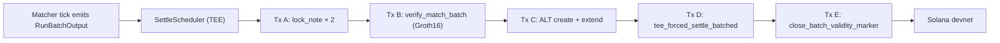

# Settlement pipeline

> Per matched batch, the TEE submits five Solana transactions in a
> documented sequence. Together they lock the input notes, verify
> the batched validity proof, build a per-batch Address Lookup
> Table, execute the atomic settle, and reclaim rent. The
> sequence is engineered to fit Solana's 1,232-byte transaction
> size cap with measured headroom.

---

## The five-transaction sequence

Each batch the matcher emits flows through the same five-tx
pipeline. The transactions are submitted by the TEE's settle
scheduler, signed by the TEE's deterministically-derived Ed25519
keypair (which also acts as the Solana fee-payer).



Each transaction is described below in detail, including its
account list, instruction data, size budget, and failure modes.

---

## Tx A — `lock_note × 2`

**Purpose.** Pin the buyer's and seller's input notes to the
specific match for the duration of settlement. Prevents the user
from withdrawing the same notes while they're in flight.

**Inputs (per side):**
- `note_commitment` (32 bytes) — the input note's Poseidon hash
- `order_id` (16 bytes) — the order this lock binds to
- `expiry_slot` (u64) — must satisfy `expiry_slot ≤ current_slot
  + MAX_LOCK_TTL_SLOTS (216,000 ≈ 24h)`
- `amount` (u64) — the note's value
- `token_mint` (32-byte Solana pubkey) — the note's asset
- `merkle_root` (32 bytes) — the root the user's VALID_INPUT proof
  was generated against
- `proof` (256 bytes) — the user's VALID_INPUT Groth16 proof

**Account list (4 accounts):**
1. `tee_authority` (signer, writable) — the TEE's pubkey, must
   equal `vault_config.tee_pubkey`
2. `vault_config` (PDA, readonly)
3. `note_lock` (PDA, writable, init) — seeded by `note_commitment`
4. `system_program` (readonly)

**Size.** ~520 bytes per lock_note tx including signatures and
blockhash. Two separate transactions (one per side) total ~1,040
bytes of submitted data — well within the cap.

**Why two separate transactions.** In principle, two `lock_note`
instructions can be batched into one transaction. In practice, the
combined size approaches the 1,232-byte cap once you account for
account metas, signatures, and the per-ix data. PR 4g.3 ships them
as separate txs to keep the headroom comfortable; PR 4g.5 may
batch them into one v0 tx with the per-batch ALT.

**Failure modes:**
- `Unauthorized` — the TEE pubkey doesn't match the registered one
- `StaleMerkleRoot` — the proof's root isn't in the recent-32 ring
- `InvalidExpirySlot` — the requested expiry exceeds the cap
- `InvalidProof` — the VALID_INPUT proof doesn't verify
- `AccountAlreadyInUse` — the note is already locked (concurrent
  match against the same note, or replay)

---

## Tx B — `verify_match_batch`

**Purpose.** Submit the TEE's VALID_MATCH_BATCH Groth16 proof and
the batch Merkle root. Creates the `BatchValidityMarker` PDA that
Tx D consumes.

**Inputs:**
- `merkle_root` (32 bytes) — the root of the batch's per-slot
  leaves
- `proof` (256 bytes) — VALID_MATCH_BATCH Groth16 proof (N=16
  instantiation)

**Account list:**
1. `tee_authority` (signer, writable)
2. `vault_config` (PDA, readonly)
3. `batch_validity_marker` (PDA, writable, init) — seeded by
   `merkle_root`
4. `system_program` (readonly)

**Size.** ~640 bytes per tx. Comfortable headroom.

**The proof verification.** The handler:
1. Calls `groth16-solana::verify_groth16_proof` with the
   `vk_match_batch_n16.rs` constants compiled into the program.
2. Public inputs: a single 32-byte field element = the batch
   Merkle root.
3. If verification succeeds, allocates the `BatchValidityMarker`
   PDA at the address derived from `[b"batch_validity", merkle_root]`.

The cost of the verify is ~2.5M compute units on Solana — the
single most CU-expensive instruction in the protocol. The 1.4M
CU budget per tx (Solana's default) covers it comfortably; we
explicitly bump the budget via a compute-budget ix at tx
construction time.

**Failure modes:**
- `Unauthorized` — TEE pubkey check
- `InvalidProof` — proof doesn't satisfy the VK constants
- `AccountAlreadyInUse` — the batch root has been submitted before
  (replay protection)

---

## Tx C — Per-batch Address Lookup Table

**Purpose.** Build a per-batch ALT holding the five derivable PDAs
the settle tx (Tx D) will reference: `note_lock_a`, `note_lock_b`,
`note_lock_e` (buyer change), `note_lock_f` (seller change), and
`batch_validity_marker`. The ALT lets Tx D fit under the 1,232-byte
cap.

**Two instructions in one tx:**
1. `createLookupTable(recent_slot, authority)` — allocates a fresh
   ALT keyed by the slot.
2. `extendLookupTable(addresses[])` — adds the five PDA addresses.

**Critical gotcha** (documented in CRYPTOGRAPHY.md §9): `recent_slot`
must come from `getLatestBlockhashAndContext().context.slot`, NOT
from `getSlot("confirmed")`. The latter can return a leader-skipped
slot, which the runtime rejects with "is not a recent slot." The
TEE's RPC client wrapper enforces the right call path.

**Size.** ~250 bytes per tx. Comfortable.

**ALT lifecycle.** ALTs have a 512-slot (~3.5 minute) deactivation
cooldown after being closed. For production matchers running
multiple batches per minute, this would mean a steady accumulation
of active ALTs. The current design uses one ALT per batch; a
future v2 will pool pre-warmed ALTs to amortize creation cost.

**Why a per-batch ALT instead of a static one.** The five PDAs
that go into the ALT are derived from the match's specific data
(note commitments, batch root). They change every batch. A static
ALT holding only stable addresses (the program ids, the
system program, the vault config) saves only ~96 bytes; not
enough to make the difference. The per-batch ALT pulls the five
match-specific PDAs into the ALT's compressed encoding, saving
~155 bytes — that's what makes Tx D fit.

---

## Tx D — `tee_forced_settle_batched`

**Purpose.** The atomic settle. Consumes both input notes, creates
change notes, transfers tokens between users' note values, and
emits a `TradeSettled` event. The single most architecturally
complex instruction in the protocol.

**Inputs (the `MatchResultPayload`):**

```rust
pub struct MatchResultPayload {
    pub note_a: [u8; 32],          // buyer's input note
    pub note_b: [u8; 32],          // seller's input note
    pub note_e: [u8; 32],          // buyer's change note (0 if none)
    pub note_f: [u8; 32],          // seller's change note (0 if none)
    pub owner_buyer: [u8; 32],     // buyer's trading_key
    pub owner_seller: [u8; 32],    // seller's trading_key
    pub user_commitment_buyer: [u8; 32],
    pub user_commitment_seller: [u8; 32],
    pub buyer_note_value: u64,
    pub seller_note_value: u64,
    pub base_amt: u64,             // base-asset transferred
    pub quote_amt: u64,            // quote-asset transferred
    pub buyer_change_amt: u64,
    pub seller_change_amt: u64,
    pub buyer_fee_amt: u64,
    pub seller_fee_amt: u64,
    pub buyer_relock_order_id: [u8; 16],
    pub buyer_relock_expiry: u64,
    pub seller_relock_order_id: [u8; 16],
    pub seller_relock_expiry: u64,
    pub price: u64,                // batch clearing price
    pub pyth_at_match: u64,        // Pyth TWAP snapshot
    pub batch_slot: u64,
    pub match_idx: u8,             // position within the batch (0..16)
}
```

**Account list (variable, ~10-12 accounts):**
1. `tee_authority` (signer)
2. `vault_config` (PDA)
3. `merkle_tree` (writable; new leaves appended)
4. `note_lock_a` (writable; consumed)
5. `note_lock_b` (writable; consumed)
6. `note_lock_e` (writable; allocated if `buyer_change_amt > 0`)
7. `note_lock_f` (writable; allocated if `seller_change_amt > 0`)
8. `consumed_note_a` (writable, init)
9. `consumed_note_b` (writable, init)
10. `batch_validity_marker` (readonly; the marker from Tx B)
11. `instructions_sysvar` (readonly)
12. `system_program` (readonly)

Accounts 1-3, 10-12 are static across all settle txs in a session;
they go in the static settle ALT created at devnet-setup time.
Accounts 4-9 are per-batch-derivable; they go in the per-batch ALT
from Tx C. The result: Tx D's wire-encoded account list is ~12
indexes (1 byte each), not 12 × 32-byte pubkeys.

**Size.** ~1,130 bytes per tx including signatures, blockhash,
both ALT references, and the 448-byte canonical payload. Tight
but comfortable (~100 byte headroom).

**The handler's logic:**
1. Verify the TEE signature over the canonical payload hash using
   the on-chain `vault_config.tee_pubkey`.
2. Verify the match is in the batch by re-deriving the match's
   leaf hash and walking the inclusion path (committed via the
   `batch_validity_marker`).
3. Consume `note_a` and `note_b`: allocate `ConsumedNoteEntry`
   PDAs at addresses derived from the note commitments.
4. Append `note_e` and `note_f` (if non-zero) as new Merkle tree
   leaves.
5. Update the per-mint `outstanding[mint]` counters.
6. If `buyer_relock_order_id != [0; 16]`, allocate a fresh
   `NoteLock` PDA pinning `note_e` to `buyer_relock_order_id`
   (this is partial-fill re-lock — a partially-filled order's
   residual stays locked for matching against the next batch).
7. Same for seller side.
8. Emit `TradeSettled` event with full match metadata.

The atomicity: every state change in a settle ix happens in the
same Solana transaction. Either the whole tx succeeds (all
consumed, all locks released, all balances updated, event
emitted), or none of it does.

**Failure modes:**
- `TeeSignatureInvalid` — the TEE pubkey doesn't match
- `MerkleInclusionFailed` — the inclusion path doesn't reproduce
  the batch root
- `NoteLockMismatch` — the lock's token_mint, amount, or order_id
  doesn't match the payload
- `ConservationViolated` — outstanding[mint] would go negative
- `AccountAlreadyInUse` — the consumed_note PDA already exists
  (replay — already settled)

---

## Tx E — `close_batch_validity_marker`

**Purpose.** Reclaim the SOL rent locked in the
`BatchValidityMarker` PDA after all matches in the batch have
settled. Closes the loop.

**Account list:**
1. `tee_authority` (signer, writable; receives the reclaimed rent)
2. `batch_validity_marker` (writable, closed)
3. `vault_config` (readonly)
4. `system_program` (readonly)

**Size.** ~250 bytes. Trivial.

**Why separate from Tx D.** The `BatchValidityMarker` is **1:N** —
one per batch, referenced by every match in the batch. If Tx D
closed it as part of the per-match settle, the first match would
brick all subsequent matches in the batch. CLAUDE.md §7.4
documents this in detail; an early implementation tried to close
the marker per-match and got caught by an external PR-reviewer.

The current design: Tx E runs once after ALL matches in the batch
have settled successfully. If any match in the batch failed (or
the batch was abandoned), the marker stays open until manually
swept (rare; future maintenance task).

---

## The 1,232-byte transaction size budget

Solana caps a single transaction at 1,232 bytes including
signatures, blockhash, account list, and instruction data. Several
of Nyx's settle txs are right at the edge:

| Tx | Approx size | Headroom |
|---|---|---|
| Tx A (lock_note × 2 as separate txs) | ~520 B each | ~700 B per tx |
| Tx A (batched into one tx, v0 + ALT) | ~1,050 B | ~180 B |
| Tx B (verify_match_batch) | ~640 B | comfortable |
| Tx C (ALT create + extend) | ~250 B | comfortable |
| Tx D (tee_forced_settle_batched, v0 + 2 ALTs) | ~1,130 B | ~100 B |
| Tx E (close marker) | ~250 B | comfortable |

The tightest tx is Tx D. Every account added or instruction-data
byte costs from the 100-byte headroom. Rules of thumb:

1. **Static accounts go in the settle ALT** created at devnet-setup
   time. Currently hoisted: `vault_config`, `instructions_sysvar`,
   `system_program`.

2. **Per-batch derivable accounts go in the per-batch ALT** from
   Tx C. Currently hoisted: `note_lock_a/b/e/f`,
   `batch_validity_marker`.

3. **Don't add new fields to `MatchResultPayload` without
   checking the budget.** The payload is currently 448 bytes;
   any new field has to pay for itself in some compensating
   savings.

CLAUDE.md §5 documents the budget in detail with measurement
methodology.

---

## ALT lifecycle and rotation

ALTs have two state transitions clients care about:

1. **Deactivation cooldown.** After `closeLookupTable`, the ALT
   enters a 512-slot (~3.5 minutes on Solana mainnet) "cooldown"
   state during which references to it in v0 transactions still
   resolve. After cooldown, the ALT is fully deactivated; new
   txs can't reference it.

2. **Address cap.** Each ALT holds at most 256 addresses. Our
   per-batch ALT uses only 5 of the 256 slots — there's room to
   bundle multiple batches' settles into one ALT if a future
   batch-batcher wants to.

For the current design (one ALT per batch), the lifecycle is:

```text
Tx C creates ALT → Tx D references ALT (extend complete)
                 → Tx D submits
                 → settle confirms
                 → ALT is no longer needed
                 → ALT decays naturally (rent is returned via
                   close in a maintenance task)
```

The "rent is returned via close in a maintenance task" piece is
future work; the current implementation lets the ALT rent sit
indefinitely. The economics: ~$0.001 per ALT, ~50 ALTs per day
at modest throughput = ~$1.50/month in lost rent on devnet, ~
proportionally on mainnet. Not zero, not load-bearing.

---

## Failure recovery

The settle scheduler's job-state machine handles partial failures:

| Failure stage | Recovery |
|---|---|
| Tx A: blockhash expired | Resubmit Tx A with fresh blockhash; retry up to 3× |
| Tx A: VALID_INPUT proof rejected | Hard fail; mark job `Failed { reason: "valid_input rejected" }`; release any locks already taken |
| Tx B: VALID_MATCH_BATCH proof rejected | Hard fail; mark all jobs in batch `Failed`; no recovery possible |
| Tx C: ALT creation failed | Hard fail; mark jobs `Failed`; user's funds remain in the locked state until lock expiry (~24h) |
| Tx D: signature verify failed | Should not happen; if it does, multisig rotation is needed |
| Tx D: Merkle inclusion failed | Should not happen if Tx B succeeded; would indicate a bug in the prover/verifier |
| Tx E: marker close failed | Soft fail; the rent stays locked. Sweep with a maintenance task. |

The state surface is exposed via `GET /settlement/status/{batch_id}`
so operators (and the upcoming SDK's `verifySettleConfirmed()`
helper) can poll for completion.

---

## Observability

Each settle leg emits structured logs (tracing crate) at info
level on the TEE side and emits Solana events on the chain side:

- `MatchScheduled` (TEE-side log, batch_id + match count)
- `LockSubmitted` (per side, with tx sig)
- `BatchProofSubmitted` (with verify tx sig)
- `SettleSubmitted` (per match, with tx sig + clearing price)
- `BatchClosed` (close marker tx sig)

The events surface through `GET /settlement/status/{batch_id}`
for clients and through the standard Solana RPC `getSignatureStatuses`
for anyone running tx-level monitoring.

---

## Bench numbers

Each leg's wall-clock contribution on Solana devnet (rough):

| Leg | Wall-clock | Notes |
|---|---|---|
| Tx A submission | ~10 ms | Network round-trip |
| Tx A confirmation | ~400 ms | Solana confirmation latency |
| Tx B submission | ~10 ms | Same |
| Tx B confirmation | ~400 ms | Same |
| Tx C submission + confirmation | ~400 ms | Combined; small payload |
| Tx D submission + confirmation | ~600 ms | Larger ix, more state writes |
| Tx E submission + confirmation | ~400 ms | Trivial close |
| **Total per match** | **~2.2 s** | Dominated by Solana finality |

The in-TEE work (witness construction, Groth16 prove, payload
signing) is comparatively cheap — under 100ms per match at the
current implementation stage. The settle latency is the chain,
not the TEE.

---

*Last updated 2026-05-29. Source of truth: `CRYPTOGRAPHY.md` §9,
`programs/vault/src/instructions/tee_forced_settle_batched.rs`,
`docs/v3.5-migration.md`.*
</content>
