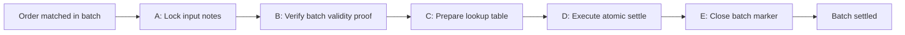

# Settlement pipeline

> This page explains settlement from an integrator perspective:
> what happens after your order matches, what statuses you can expect,
> and how to track completion on-chain.

---

## What you need to know

- Settlement is **asynchronous**.
- One matched batch goes through a fixed 5-step pipeline.
- You track progress with `GET /settlement/status/{batch_id}`.
- Final confirmation comes from on-chain transaction signatures returned by that endpoint.

---

## The five-step sequence



High-level meaning:
- **A** prevents double-use of input notes during settlement.
- **B** confirms the batch-level validity proof.
- **C** prepares address lookup references for efficient transaction encoding.
- **D** applies the actual value transfer and state updates.
- **E** closes the loop for that batch.

---

## How clients should monitor settlement

Once an order is matched, it will reference a `batch_id`.

1. Read order state via `GET /orders/{order_id}`.
2. Poll `GET /settlement/status/{batch_id}` until terminal state.
3. Optionally subscribe to the `settlement` WebSocket channel for realtime updates.
4. Use returned signatures to verify chain confirmation via Solana RPC.

`SettlementStatus.status` values:

| Status | Suggested UI copy | What the user should know |
|---|---|---|
| `pending_proof` | Preparing settlement | Match accepted; settlement work has started |
| `pending_verify_match_batch` | Verifying batch | Batch validity is being submitted on-chain |
| `pending_settles` | Settling fills | One or more matched fills are being finalized |
| `pending_close` | Finalizing batch | Settlement is complete; cleanup/final close is pending |
| `settled` | Settled | Funds/state are finalized on-chain |
| `failed` | Action needed | Show `error` and keep the batch id for support |

---

## Example settlement status payload

```json
{
  "batch_id": "42",
  "status": "pending_settles",
  "merkle_root": "0x...",
  "verify_match_batch_signature": "5x...",
  "settle_signatures": ["3a...", "9b..."],
  "close_signature": null,
  "settled_at": null,
  "error": null
}
```

When `status = "settled"`, `settled_at` should be populated and all expected signatures should be present.

Fields come directly from the OpenAPI `SettlementStatus` schema:

| Field | Meaning |
|---|---|
| `batch_id` | Stable identifier shared by orders and settlement status |
| `status` | Current pipeline stage |
| `merkle_root` | Root associated with the settled batch |
| `verify_match_batch_signature` | On-chain tx signature for batch verification |
| `settle_signatures` | Per-match settle signatures in match-index order |
| `close_signature` | Final close/cleanup tx signature |
| `settled_at` | Completion timestamp when settled |
| `error` | Human-readable failure reason when failed |

---

## Failure handling (client-facing)

If `status = "failed"`:
- Read `error` for a human-readable reason.
- Keep order and batch IDs for support/ops correlation.
- Treat settlement as incomplete until a retry/new batch is confirmed.

Operational guidance:
- Implement retry/backoff on polling.
- Show users both pipeline status and on-chain signatures.
- Avoid assuming immediate finality after match acknowledgment.
- If using WebSockets, still keep REST polling as your recovery path after reconnects.

---

## Latency expectations

Settlement time is dominated by chain confirmation, not by API round-trips.
Design your UI and bots for **eventual completion over multiple seconds**, not instant finality.

---

## Reference

For exact response fields and enums, use:
- `docs/tee-api-openapi.yaml` → `SettlementStatus`
- `docs/site/08-api-and-integration.md` → API usage flow
