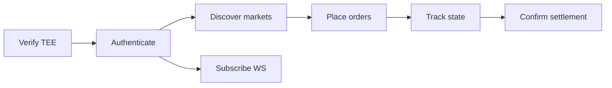

# API and integration

> A practical guide for teams integrating with Darknyx. It focuses on
> the public API contract: how to verify the TEE, authenticate,
> discover markets, place orders, monitor account state, and follow
> settlement to finality.
>
> The canonical machine-readable contract is `docs/tee-api-openapi.yaml`.

---

## Integration lifecycle



Most clients follow this sequence:

1. Verify the enclave identity with `/attestation`, `/info`, and the evidence bundle.
2. Exchange API credentials for a short-lived bearer token.
3. Fetch instruments and account/tree state.
4. Place or cancel orders.
5. Track order and settlement status through REST or WebSocket updates.

---

## Environments

| Environment | Base URL | Notes |
|---|---|---|
| Mainnet | `https://api.darknyx.example.com/api/v1` | Production endpoint placeholder |
| Devnet | `https://api.devnet.darknyx.example.com/api/v1` | Integration/testing endpoint placeholder |

All REST paths below are relative to `/api/v1`.

---

## Endpoint groups

### Verify

| Method | Path | Auth | Response schema | Use |
|---|---|---|---|---|
| GET | `/attestation` | Public | `AttestationQuote` | Fetch a fresh quote bound to your nonce |
| GET | `/info` | Public | `AppInfo` | Read compose hash, instance id, version, and TEE pubkey |
| GET | `/evidences/quote.json` | Public | raw JSON | RA-TLS quote artifact |
| GET | `/evidences/cert.pem` | Public | PEM | Certificate served by dstack-ingress |
| GET | `/evidences/acme-account.json` | Public | JSON | ACME account evidence |
| GET | `/evidences/sha256sum.txt` | Public | text | Evidence bundle integrity hash |

### Discover

| Method | Path | Auth | Response schema | Use |
|---|---|---|---|---|
| GET | `/instruments` | Public | `Instrument[]` | List supported markets |
| GET | `/instruments/{symbol}` | Public | `Instrument` | Fetch tick size, mints, min order size, oracle metadata |
| GET | `/transparency` | Public | `TransparencySnapshot` | Verify reserves, current attestation, and aggregate health |

### Trade

| Method | Path | Auth | Response schema | Use |
|---|---|---|---|---|
| POST | `/auth/token` | Public | `AuthTokenResponse` | Create a bearer token |
| POST | `/auth/token/revoke` | Bearer | none | Revoke current bearer token |
| POST | `/orders` | Bearer | `Order` | Place an order |
| GET | `/orders/{order_id}` | Bearer | `Order` | Read order status/fill state |
| DELETE | `/orders/{order_id}` | Bearer | `Order` | Cancel an open order |
| POST | `/orders/mass-quote` | Bearer | `MassQuoteResponse` | Atomic cancel-replace batch for market makers |

### Account and tree state

| Method | Path | Auth | Response schema | Use |
|---|---|---|---|---|
| GET | `/account` | Bearer | `Account` | Balances, open orders, and spendable notes |
| GET | `/tree/root` | Public | `TreeRoot` | Current mirrored Merkle root and leaf count |
| GET | `/tree/inclusion?commitment=...` | Bearer | `InclusionProof` | Inclusion proof for a note commitment |
| GET | `/tree/leaves?from=&to=` | Bearer | leaf page | Page through tree leaves |

### Settlement

| Method | Path | Auth | Response schema | Use |
|---|---|---|---|---|
| GET | `/settlement/status/{batch_id}` | Bearer | `SettlementStatus` | Track batch progress and L1 tx signatures |

---

## 1. Verify the TEE

Before sending order intent, verify that the API is backed by the
expected TDX confidential VM.

```http
GET /attestation?reportData=<32-byte-nonce-hex>
GET /info
GET /evidences/quote.json
GET /evidences/cert.pem
GET /evidences/acme-account.json
GET /evidences/sha256sum.txt
```

At a high level, the client should verify:

- The TDX quote is valid.
- `report_data[0..32]` matches the nonce you supplied.
- `report_data[32..64]` binds the quote to `SHA-256(tee_pubkey)`.
- The runtime identity (`compose_hash`, app/instance metadata, and TEE pubkey) matches your policy.
- The TLS evidence bundle has not been tampered with.

If verification fails, do not authenticate or place orders.

---

## 2. Authenticate

Darknyx uses client-credentials style authentication. Long-lived
credentials are exchanged for a short-lived bearer token.

```http
POST /auth/token
Content-Type: application/json

{
  "api_key": "your-api-key",
  "api_secret": "your-api-secret",
  "passphrase": "your-passphrase"
}
```

```json
{
  "access_token": "eyJ...",
  "token_type": "Bearer",
  "expires_in": 3600,
  "account_id": "acct_123"
}
```

Use the token on authenticated requests:

```http
Authorization: Bearer eyJ...
```

Revoke a token with `POST /auth/token/revoke`.

---

## 3. Discover markets

Use `/instruments` before constructing orders. Instrument metadata
tells you the market symbol, base/quote mints, tick size, minimum
order size, and oracle configuration.

```http
GET /instruments
```

```json
[
  {
    "symbol": "SOL-USDC",
    "base_mint": "So111...",
    "quote_mint": "EPjF...",
    "tick_size": "0.01",
    "min_order_size": "0.1",
    "oracle": {
      "type": "pyth_pull_v2",
      "pubkey": "HovQ...",
      "circuit_breaker_bps": 500
    }
  }
]
```

---

## 4. Place an order

`POST /orders` accepts a `PlaceOrderRequest`. The API supports:

- `limit`
- `ioc` (immediate-or-cancel)
- `fok` (fill-or-kill)

```http
POST /orders
Authorization: Bearer eyJ...
Content-Type: application/json
```

```json
{
  "symbol": "SOL-USDC",
  "side": "buy",
  "order_type": "limit",
  "amount": "10",
  "price_limit": "150.25",
  "min_fill_size": "1",
  "expiry_slot": 320145000,
  "note_commitment": "0x...",
  "user_commitment": "0x...",
  "trading_key_signature": "base64...",
  "owner_commitment": "0x...",
  "note_nonce": "0x...",
  "note_blinding": "0x...",
  "nullifier": "0x...",
  "merkle_root": "0x...",
  "valid_input_proof": "0x..."
}
```

Successful response:

```json
{
  "order_id": "ord_123",
  "symbol": "SOL-USDC",
  "side": "buy",
  "order_type": "limit",
  "amount": "10",
  "price_limit": "150.25",
  "status": "pending",
  "filled_amount": "0",
  "average_fill_price": "0",
  "created_at": "2026-05-29T12:00:00Z",
  "last_fill_at": null,
  "batch_id": null
}
```

### Order statuses

| Status | Meaning |
|---|---|
| `pending` | Accepted and waiting in the book |
| `partial` | Partially filled; residual remains active |
| `filled` | Fully filled |
| `expired` | Expiry slot reached |
| `cancelled` | Cancelled before completion |

---

## 5. Cancel and mass quote

Cancel an open order:

```http
DELETE /orders/{order_id}
Authorization: Bearer eyJ...
```

Market makers should use `POST /orders/mass-quote` for atomic
cancel-replace updates. A mass quote contains up to 20 pairs and
is processed as a single batch: either the whole operation succeeds
or it fails without partial state.

```json
{
  "pairs": [
    {
      "cancel_order_id": "ord_old",
      "place": {
        "symbol": "SOL-USDC",
        "side": "sell",
        "order_type": "limit",
        "amount": "5",
        "price_limit": "151.00",
        "note_commitment": "0x...",
        "user_commitment": "0x...",
        "trading_key_signature": "base64...",
        "owner_commitment": "0x...",
        "note_nonce": "0x...",
        "note_blinding": "0x...",
        "nullifier": "0x...",
        "merkle_root": "0x...",
        "valid_input_proof": "0x..."
      }
    }
  ]
}
```

---

## 6. Read account and tree state

`GET /account` returns the user-facing account snapshot:

- balances by mint
- locked vs available amounts
- open orders
- spendable notes

`/tree/*` endpoints help clients build or refresh note proofs:

| Endpoint | Use |
|---|---|
| `/tree/root` | Current root and leaf count |
| `/tree/inclusion?commitment=...` | Inclusion proof for one note |
| `/tree/leaves?from=&to=` | Leaf pagination for resync |

The TEE-served tree data is a convenience read. Clients can verify
roots against on-chain state when correctness matters.

---

## 7. Track settlement

After an order matches, its `Order.batch_id` links it to settlement.

```http
GET /settlement/status/{batch_id}
Authorization: Bearer eyJ...
```

```json
{
  "batch_id": "42",
  "status": "pending_settles",
  "merkle_root": "0x...",
  "verify_match_batch_signature": "5x...",
  "settle_signatures": ["3a...", "9b..."],
  "close_signature": null,
  "settled_at": null,
  "error": null
}
```

| Status | User-facing meaning |
|---|---|
| `pending_proof` | Batch is preparing proof material |
| `pending_verify_match_batch` | Batch validity is being submitted |
| `pending_settles` | Individual matches are settling |
| `pending_close` | Batch is finalizing |
| `settled` | Settlement is complete |
| `failed` | Settlement failed; inspect `error` |

---

## 8. Use WebSocket for realtime UX

WebSocket URL: `/v1/stream`

Login:

```json
{
  "op": "login",
  "token": "eyJ...",
  "cancel_on_disconnect": true
}
```

Subscribe:

```json
{
  "op": "subscribe",
  "channels": ["orders", "fills", "account", "settlement", "tree"]
}
```

Heartbeat:

```json
{ "op": "ping" }
```

Channels:

| Channel | Use |
|---|---|
| `orders` | Order placement, partial fill, fill, cancel, expiry updates |
| `fills` | Per-fill events |
| `account` | Balance and note-state changes |
| `settlement` | Batch finalization and tx signatures |
| `tree` | Leaf append events |

Use REST for recovery and WebSocket for live UI updates.

---

## 9. Error model

All errors use the shared `Error` shape:

```json
{
  "code": "token_expired",
  "message": "Bearer token has expired — call POST /auth/token to refresh.",
  "retry_after_ms": 1000
}
```

Handle these explicitly:

| Code | Recommended client action |
|---|---|
| `token_expired` | Refresh token and retry |
| `bad_credentials` | Prompt for credential rotation/check |
| `note_already_locked` | Refresh account state; select another note |
| `commitment_not_in_tree` | Refresh tree/account state |
| `mint_mismatch` | Rebuild order with the correct note/mint |
| `min_fill_violation` | Adjust order size or min fill |
| `circuit_breaker_hit` | Wait for market/oracle conditions to normalize |
| `rate_limited` | Back off using `retry_after_ms` |

---

## End-to-end TypeScript sketch

```ts
const base = "https://api.devnet.darknyx.example.com/api/v1";

const tokenRes = await fetch(`${base}/auth/token`, {
  method: "POST",
  headers: { "Content-Type": "application/json" },
  body: JSON.stringify({ api_key, api_secret, passphrase }),
});
const { access_token } = await tokenRes.json();

const markets = await fetch(`${base}/instruments`).then((r) => r.json());

const orderRes = await fetch(`${base}/orders`, {
  method: "POST",
  headers: {
    "Content-Type": "application/json",
    Authorization: `Bearer ${access_token}`,
  },
  body: JSON.stringify(placeOrderPayload),
});
const order = await orderRes.json();

const latest = await fetch(`${base}/orders/${order.order_id}`, {
  headers: { Authorization: `Bearer ${access_token}` },
}).then((r) => r.json());

if (latest.batch_id) {
  const settlement = await fetch(`${base}/settlement/status/${latest.batch_id}`, {
    headers: { Authorization: `Bearer ${access_token}` },
  }).then((r) => r.json());
}
```